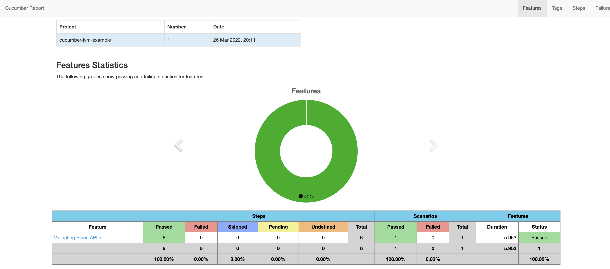

# Runner class for cucumber

```java
@RunWith(Cucumber.class)
@CucumberOptions( 
			features = "src/test/java/features",
			glue = {"stepDefinitions"}
		)
public class TestRunner {

}
```
# Example of Tags
Runner class will look like this

```java
import org.junit.runner.RunWith;

import io.cucumber.junit.Cucumber;
import io.cucumber.junit.CucumberOptions;

@RunWith(Cucumber.class)
@CucumberOptions( 
			features = "src/test/java/features/validatePlaceAPI.feature",
			glue = {"stepDefinitions"},
			tags = "@DeletePlace"
		)
public class TestRunner {
}
```
Hooks class will look like this

```java
import io.cucumber.java.Before;

public class Hooks {
	
	@Before("@DeletePlace")
	public void beforeScenario() throws IOException
	{
		//write code to get place id
		//execute code only when place id is null
		stepDefinitions sd = new stepDefinitions();
		if(sd.place_id == null) {
		sd.add_place_payload_with("Shetty", "French", "Asia");
		sd.when_user_calls_with_http_request("addPlaceAPI", "POST");
		sd.verify_place_id_created_maps_to_using("Shetty", "getPlaceAPI");
		}
	}
```
# How to run tests using mvn command
```java
mvn test
```

# How to pass tags while running tests from maven
```java
mvn test -Dcucumber.options="--tags @DeletePlace"
```
# Generating Reports using plugin
Reporting plugin that we are using is below
<a href="https://github.com/damianszczepanik/maven-cucumber-reporting">https://github.com/damianszczepanik/maven-cucumber-reporting </a>

Command to generate reports

mvn test verify

test -> to run tests
verify -> generate reports after running all the tests

After this reports are generated under target/cucumber-html-reports
Report would look like below.
JSON Structure for example



